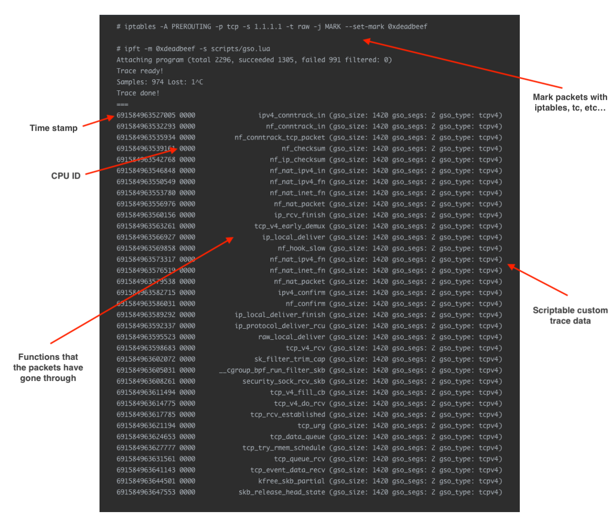

# ipftrace2

`ipftrace2` is a tool which allows you to trace the journey of packets inside the Linux kernel.
It is similar to the `ftrace` in some sense but, you can trace **which flow have gone through
which functions** inside the kernel which is usually more important information for the network
people than **which functions are called** information provided by `ftrace`.



## Supported environments

- Architecture: (Currently) x86_64 only
- Linux version: v4.17 or above

## Install pre-compiled binary

### Step1: Install `ipft` command

```
$ curl -OL https://github.com/YutaroHayakawa/ipftrace2/releases/download/v0.3.0/ipftrace2_amd64.tar.gz
$ tar xvf ipftrace2_amd64.tar.gz
$ sudo cp ipft /usr/local/bin/ipft
```

### Step2: Prepare kernel BTF

If your kernel is compiled with `CONFIG_DEBUG_INFO_BTF=y`, you can skip this step.
You should see `/sys/kernel/btf/vmlinux` file in this case.

#### Step2-1: Install pahole

Please install [pahole](https://git.kernel.org/pub/scm/devel/pahole/pahole.git) >= v1.19

```
$ git clone https://git.kernel.org/pub/scm/devel/pahole/pahole.git
$ git checkout v1.19
$ cmake -D__LIB="lib" -DCMAKE_INSTALL_PREFIX="/usr/local" -DEXEC_INSTALL_PREFIX="" .
$ make
$ sudo make install
```

#### Step2-2: Install llvm-objcopy

Please install `llvm-objcopy` since `pahole` depends on it

```
# CentOS 8, Fedora 31, Fedora 32
$ sudo dnf install llvm

# Ubuntu 19.10, 20.04
$ sudo apt-get install llvm
```

#### Step2-3: Install DWARF debug information (please take care of the disk usage)

```
# CentOS 8
$ sudo dnf --enablerepo=base-debuginfo install kernel-debuginfo-$(uname -r)

# Fedora 31, 32
$ sudo dnf --enablerepo=fedora-debuginfo install kernel-debuginfo-$(uname -r)

# Ubuntu 19.10, 20.04
$ sudo apt-key adv --keyserver keyserver.ubuntu.com --recv-keys C8CAB6595FDFF622
$ codename=$(lsb_release -c | awk  '{print $2}')
$ sudo tee /etc/apt/sources.list.d/ddebs.list << EOF
deb http://ddebs.ubuntu.com/ ${codename}      main restricted universe multiverse
deb http://ddebs.ubuntu.com/ ${codename}-updates  main restricted universe multiverse
deb http://ddebs.ubuntu.com/ ${codename}-proposed main restricted universe multiverse
EOF
$ sudo apt-get update
$ sudo apt-get install linux-image-$(uname -r)-dbgsym
```

#### Step2-4 Encode BTF to debuginfo

```
$ sudo LD_LIBRARY_PATH=/usr/local/lib pahole -J
```

### Step3: List the tracable functions

```
$ sudo ipft -l
```

## Build from source

```
$ mkdir build
$ cd build
$ cmake ../
$ make
```

`cmake` will find the missing dependencies, please install it if your build failed.

## Usage

### Step1: Mark the packets you are interested in

`ipftrace2` depends on the `skb->mark` to identify which packet to trace.
There are several ways to mark the packet. Here are the examples by `iptables` .
The essential part is `-j MARK --set-mark 0xdeadbeef` .
You can use arbitrary matches you wish to use.

```
# by iptables (for RX)
$ sudo iptables -t raw -A PREROUTING -p icmp -s 1.1.1.1 -j MARK --set-mark 0xdeadbeef

# by iptables (for TX)
$ sudo iptables -t raw -A OUTPUT -p icmp -d 1.1.1.1 -j MARK --set-mark 0xdeadbeef
```

You can use other ways like below

- tc-ingress (http://man7.org/linux/man-pages/man8/tc-skbedit.8.html)
- nftables (https://wiki.nftables.org/wiki-nftables/index.php/Setting_packet_metainformation)
- SO_MARK (http://man7.org/linux/man-pages/man7/socket.7.html)

### Step2: Start tracing

#### Step2-1: Trace as much functions as we can

Here is the simplest example of tracing which is useful for debugging or learning purpose.
But **don't do this on your production environment**. Because, `ipftrace2` may attach the
tracing eBPF program to **hundreds or thousands** of kernel functions which takes
`struct sk_buff *` as argument by default. The overhead made by it shouldn't be acceptable.

```
$ sudo ipft -m 0xdeadbeef
```

#### Step2-2: Trace the subset of possible functions

If you don't want to trace all possible functions, you can specify Perl-style regex to filter
the functions to trace by name. You can reduce the overhead of the tracing and time to attach
the programs by this feature.

```
$ sudo ipft -m 0xdeadbeef -r "ip_.*"
```

### Step-3: Generate the packet

Now you are ready to trace. Generate the packet from another shell.

```
$ curl https://1.1.1.1
````

## Advanced usage

### Use custom script

`ipftrace2` is capable of customizing the tracing by C and Lua script. By using this feature, you can
trace more than just functions the packets have gone through, but the content of `skb` or any
other data associate with it. Please see [Scripting manual](docs/scripting.md) for more details.
Also, you can find the examples in `example` directory.

```
$ sudo ipft -m 0xdeadbeef -s example/gso.lua
```

### Use JSON stream output

`ipftrace2` supports JSON output that streams tracing samples with machine-readable JSON format. Compared
to the default "aggregated" output, "streaming" output is more memory efficient, but users are responsible
for parsing/aggregating the tracing samples by themselves. For more details, please see the [doc](docs/output.md).

```
$ sudo ipft -m 0xdeadbeef -o json
```
