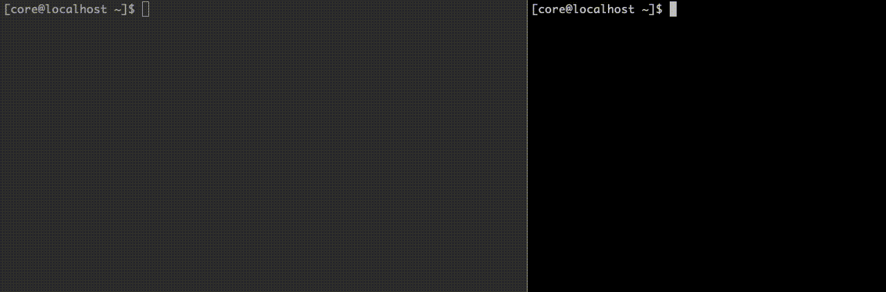

# ipftrace2

`ipftrace2` is a tool which allows you to trace the journey of packets inside the Linux kernel. It is similar to `ftrace` in some sense, but you can trace **which flow has gone through which functions** inside the kernel which is usually more important information for the network people than **which functions are called** information provided by `ftrace`.



## Requirements

- Architecture: x86_64

- Linux version: v4.17 or above

- Kernel config

  - CONFIG_DEBUG_INFO_BTF=y
  - CONFIG_KPROBES=y
  - CONFIG_PERF_EVENTS=y
  - CONFIG_BPF=y
  - CONFIG_BPF_SYSCALL=y

  - CONFIG_DEBUG_INFO_BTF_MODULE=y (Optional)
    - Enabling this allows ipftrace2 to trace kernel module's functions

## Install

ipftrace2 is a single-binary application. You don't have to install any dependencies.

```
curl -OL https://github.com/YutaroHayakawa/ipftrace2/releases/download/v0.7.0/ipftrace2_amd64.tar.gz
tar xvf ipftrace2_amd64.tar.gz
sudo cp ipft /usr/local/bin/ipft
```

## Basic usage

Run ipftrace2

```
sudo ipft -m 0xdeadbeef
```

Mark the packets you are interested in

```
# Mark packets from/to 1.1.1.1
sudo iptables -t raw -A OUTPUT -d 1.1.1.1 -j MARK --set-mark 0xdeadbeef
sudo iptables -t raw -A PREROUTING -s 1.1.1.1 -j MARK --set-mark 0xdeadbeef
```

Make some traffic

```
curl https://1.1.1.1
```

Terminate `ipft` with `Ctrl-C` . Then, you should see the output.

## Feature highlight

#### Function tracer

Records function calls for packets. This is the default tracer.

```
$ sudo ipft -m 0xdeadbeef
<skip...>
96976848684329       000                      nf_checksum
96976848692769       000                   nf_ip_checksum
96976848765647       000               tcp_v4_early_demux
96976848836855       000                 ip_local_deliver
96976848840849       000                     nf_hook_slow
96976848846012       000          ip_local_deliver_finish
96976848851032       000          ip_protocol_deliver_rcu
<skip...>
```

#### Function graph tracer

Records function calls as well as function returns and visualizes the call depth.

```
$ sudo ipft -m 0xdeadbeef -t function_graph
<skip...>
480959550911894      000 ip_protocol_deliver_rcu() {
480959550913049      000   raw_local_deliver() {
480959550914188      000   }
480959550915380      000   tcp_v4_rcv() {
480959550916635      000     tcp_filter() {
480959550917812      000       sk_filter_trim_cap() {
480959550918999      000         security_sock_rcv_skb() {
480959550920116      000         }
480959550921258      000       }
480959550922397      000     }
<skip...>
```

#### Raw JSON output

Generates raw tracing output to `stdout` in machine-readable JSON. You can implement your own visualizer with this feature.

```
$ sudo ipft -m 0xdeadbeef -t function_graph -o json
<skip...>
{"packet_id":"0xffff8dee8aea9700","timestamp":25340022557487,"processor_id":0,"function":"validate_xmit_xfrm","is_return":false}
{"packet_id":"0xffff8dee8aea9700","timestamp":25340022558860,"processor_id":0,"function":"validate_xmit_xfrm","is_return":true}
{"packet_id":"0xffff8dee8aea9700","timestamp":25340022560159,"processor_id":0,"function":"validate_xmit_skb","is_return":true}
{"packet_id":"0xffff8dee8aea9700","timestamp":25340022561440,"processor_id":0,"function":"validate_xmit_skb_list","is_return":true}
{"packet_id":"0xffff8dee8aea9700","timestamp":25340022572083,"processor_id":0,"function":"dev_hard_start_xmit","is_return":false}
{"packet_id":"0xffff8dee8aea9700","timestamp":25340022574087,"processor_id":0,"function":"skb_clone_tx_timestamp","is_return":false}
{"packet_id":"0xffff8dee8aea9700","timestamp":25340022575519,"processor_id":0,"function":"skb_clone_tx_timestamp","is_return":true}
<skip...>
```

#### Custom tracing output

You can customize your tracing output by providing custom BPF and Lua program.

```
$ sudo ipft -m 0xdeadbeef -s script.lua
<skip...>
96976848684329       000                      nf_checksum ( len: 2822 )
96976848692769       000                   nf_ip_checksum ( len: 2822 )
96976848765647       000               tcp_v4_early_demux ( len: 2822 )
96976848836855       000                 ip_local_deliver ( len: 2822 )
96976848840849       000                     nf_hook_slow ( len: 2822 )
96976848846012       000          ip_local_deliver_finish ( len: 2822 )
96976848851032       000          ip_protocol_deliver_rcu ( len: 2802 )
<skip...>
```

Of course, you can use scripting together with JSON output.

```
$ sudo ipft -m 0xdeadbeef -s script.lua -o json
<skip...>
{"packet_id":"0xffff935007672900","timestamp":169530008921,"processor_id":0,"function":"__ip_finish_output","is_return":false,"len":"40"}
{"packet_id":"0xffff935007672900","timestamp":169530010558,"processor_id":0,"function":"ip_finish_output2","is_return":false,"len":"40"}
{"packet_id":"0xffff935007672900","timestamp":169530012511,"processor_id":0,"function":"dev_queue_xmit","is_return":false,"len":"54"}
{"packet_id":"0xffff935007672900","timestamp":169530014441,"processor_id":0,"function":"__dev_queue_xmit","is_return":false,"len":"54"}
{"packet_id":"0xffff935007672900","timestamp":169530017180,"processor_id":0,"function":"netdev_core_pick_tx","is_return":false,"len":"54"}
<skip...>
```

## Usage

```
Usage: ipft [OPTIONS]

Options:
 -b, --backend            [BACKEND]       Specify trace backend
 -h, --help                               Show this text
 -l, --list                               List functions
 -m, --mark               [NUMBER]        Trace the packet marked with <mark> [required]
   , --mask               [NUMBER]        Only match to the bits masked with given bitmask (default: 0xffffffff)
 -o, --output             [OUTPUT-FORMAT] Specify output format
 -r, --regex              [REGEX]         Filter the function to trace with regex
 -s, --script             [PATH]          Path to extension script
 -t, --tracer             [TRACER-TYPE]   Specify tracer type
 -v, --verbose                            Turn on debug message
   , --perf-page-count    [NUMBER]        See page_count of perf_event_open(2) man page (default: 8)
   , --perf-sample-period [NUMBER]        See sample_period of perf_event_open(2) man page (default: 1)
   , --perf-wakeup-events [NUMBER]        See wakeup_events of perf_event_open(2) man page (default: 1)
   , --no-set-rlimit                      Don't set rlimit
   , --enable-probe-server                Enable probe server
   , --probe-server-port                  Set probe server port

BACKEND       := { kprobe, ftrace, kprobe-multi }
OUTPUT-FORMAT := { aggregate, json }
TRACER-TYPE   := { function, function_graph (experimental) }
```

## Further reading

- [Scripting manual](docs/scripting.md) gives you the guide to customize your tracing output with Lua script
- With [output specification](docs/output.md), you can learn how to interpret the output
- Understanding [marking](docs/marking.md) helps you a lot for fully utilizing the power of ipftrace2
- Please check this [doc](docs/internals.md) out if you are interested in the ipftrace2 internals
